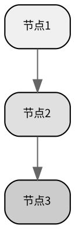

# 论文图表生成技能

## 概述

本技能封装三套独立工具脚本，覆盖论文图表三类核心产出，所有论文规范在脚本层内化固定，AI **无需操心任何渲染参数**。

| 工具脚本 | 产出 | 技术方案 |
|---------|------|---------|
| `references/stat_chart.py` | 统计图表 | plotnine（ggplot2 语法），声明式图层 |
| `references/schematic.py` | 示意图 | Graphviz DOT → PNG |
| `references/three_line_table.py` | 三线表 | HTML+WeasyPrint → PDF → PNG |

**导入方式**（AI 使用层固定模式）：

```python
import sys
sys.path.insert(0, 'skills/paper-figure-generator/references')
from stat_chart import render_statistical_chart
from schematic import render_dot_to_png
from three_line_table import render_three_line_table
```

---

## 1. 统计图表 — `render_statistical_chart()`

### 1.0 🧠 方法论：声明式图层范式

底层采用 **plotnine（ggplot2 语法）**，核心思想是**声明式图层**——数据、视觉映射、样式三者清晰分离，每一层只管自己的事。

```
数据（Data）→ 映射（Aesthetics）→ 几何层（Geom）→ 主题（Theme）
    ↑               ↑                    ↑                ↑
  你传 data dict  脚本自动映射        一行 geom_xxx     脚本内化固定
```

**三句话理解这个范式**：

1. **数据是 long-form 结构**：行 = 单次观测，列 = 变量（不像 matplotlib 需要把数据拆成多个数组分别传给不同 API）
2. **视觉通道声明式绑定**：`aes(x=..., y=..., color=..., linetype=...)` 告诉系统"x 映射到哪列、颜色映射到哪列"，系统自动处理图例、配色、分层
3. **图层叠加，每一层独立**：折线图 = `geom_line()` + `geom_point()`；柱状图 + 误差线 = `geom_col()` + `geom_errorbar()`。想加什么层就加什么层，互不干扰

**对 AI 的意义**：你不需要知道底层是 matplotlib 还是 plotnine。你只需要按 1.2 的格式组织 data dict，其余全部脚本内化。但理解这个范式对你**正确组织数据**有帮助——如果你要画多序列折线图，需要把多个 y 序列组织为 `y1, y2, y3...` 而不是拼成矩阵，因为脚本要将其转为 long-form（每个 (x, value, series) 一行）。

### 1.1 API 签名（AI 唯一入口）

```python
render_statistical_chart(
    data: dict,          # 结构化数据（格式见 1.2）
    chart_type: str,     # "line"/"bar"/"scatter"/"box"/"hist"/"violin"
    column: str,         # "single"(8cm) / "double"(17cm)
    output_path: str,    # 输出 PNG 路径
    xlabel: str = "",    # x 轴标签（含单位，如"时间 (s)"）
    ylabel: str = "",    # y 轴标签
    title: str = "",     # 标题（论文图题通常在图外 caption，慎用）
) -> dict               # {path, width_cm, height_cm, dpi=300}
```

**底层自动处理（AI 不操心）**：
- 渲染引擎：plotnine（ggplot2 语法），声明式图层
- data dict 自动转换为 long-form pandas DataFrame
- 300dpi，灰度学术配色（多序列用灰度阶梯+线型+标记形状区分）
- 去上右轴，刻度朝外，字号 9pt/8pt，WenQuanYi Micro Hei 中文回退链
- 单栏 8cm×6cm / 双栏 17cm×12.75cm（高宽比 0.75）

### 1.2 六种图表的数据格式

| chart_type | data 字段 | 说明 | 典型场景 |
|-----------|----------|------|---------|
| `line` | `x: list`, `y1: list`[, `y2`, `y3`...] | 多序列用 y1/y2/y3 命名，自动转为 long-form，线型+标记区分 | 时间序列、趋势对比 |
| `bar` | `categories: list`, `values: list`, `errors: list`(可选) | 仅单组柱状图，不支持分组对比条形图 | 实验组对比、分类汇总 |
| `scatter` | `x: list`, `y: list` | 默认同色（#333） | 相关性分析 |
| `box` | `data: list[list]`, `labels: list` | 自动转为 long-form（label, value 每行一个观测）| 多组分布对比 |
| `hist` | `data: list`, `bins: int`(可选) | 默认 20 bins，灰填充+深色边线 | 单变量分布 |
| `violin` | `data: list[list]`, `labels: list` | 自动转为 long-form，浅灰+深灰 | 分布形态+集中趋势 |

### 1.3 典型调用示例

**折线图（双序列）**
```python
data = {"x": [0, 1, 2, 3, 4, 5], "y1": [0.1, 0.4, 0.9, 1.6, 2.5, 3.6],
        "y2": [0.2, 0.6, 1.2, 2.0, 3.0, 4.2]}
result = render_statistical_chart(data, "line", "single", "chart.png",
                                   xlabel="时间 (s)", ylabel="幅值")
```

**柱状图（含误差线）**
```python
data = {"categories": ["对照组", "实验A", "实验B"],
        "values": [12.3, 18.7, 25.1],
        "errors": [1.2, 1.5, 2.0]}
result = render_statistical_chart(data, "bar", "double", "bar.png",
                                   xlabel="分组", ylabel="准确率 (%)")
```

### 1.4 Agent 决策要点

| 决策项 | 需要 agent 做什么 | 提示 |
|-------|-----------------|------|
| **选类型** | 根据数据语义判断：趋势→line，对比→bar，相关→scatter，分布→box/violin/hist | 同上表 |
| **组织 data dict** | 按 1.2 表的字段组装，确保长度一致 | 长度不一致导致隐性错误，建议前置校验 len() |
| **多序列注意** | line 类型多序列用 `y1, y2, y3...` 命名，不要用字典名（如"模型A"）当 key | 脚本自动排序 y 前缀的 key 并转为 long-form，非 y 前缀的 key 会被忽略 |
| **单栏 vs 双栏** | 看目标期刊排版 | 单栏 8cm，双栏 17cm，高宽比自动 0.75 |
| **轴标签语义** | xlabel/ylabel 必须含变量名+单位（如"温度 (℃)"）| 不加单位是不合格论文图 |
| **标题 title** | 仅当用户明确要求时才加。**论文图题标准位置在图外（caption）** | 多数场景不传 title |
| **数据量过大** | line 超 1000 点、scatter 超 10000 点应抽样 | 脚本不做自动降采样 |
| **缺失数据** | 用 None 占位后，agent 自行决定插值/虚线连接 | 脚本不自动处理缺失 |

### 1.5 ⚠️ 边界与已知限制

- **不支持分组柱状图**（如"区域×时期"的 2×2 对比）。如需要，用多子图或示意表的方案替代
- **仅输出 PNG**（300dpi），不输出 PDF/SVG
- **配色固定为灰度**（经济学/社科默认）。如有彩色展示需求，需等未来扩展
- **底层依赖 plotnine**（ggplot2 语法），非 matplotlib 手搓。这意味着数据格式强依赖于 long-form 转换，不要试图绕过 API 直接调用底层

---

## 2. 示意图 — `render_dot_to_png()`

### 2.1 API 签名

```python
render_dot_to_png(
    dot_text: str,       # DOT 语言描述文本
    output_path: str,    # 输出 PNG 路径
    column: str,         # "single"(8cm) / "double"(17cm)
) -> dict               # {path, width_cm, height_cm, dpi=300}
```

**底层自动处理**：DOT 渲染为 300dpi PNG，输出物理尺寸按栏宽缩放，自动裁剪白边。

### 2.2 Agent 决策要点

| 决策项 | 需要 agent 做什么 | 提示 |
|-------|-----------------|------|
| **方向** | 选 rankdir（TB 自上而下 / LR 自左向右） | 流程描述长文本→TB，横向对比→LR |
| **节点层级** | 按信息层级分配灰度（浅→中→深） | 见下方灰度配色表 |
| **换行** | 多行文本用 HTML-like label `<br/>` | `label=<行1<br/>行2>`，引号包裹 |
| **分组** | 逻辑分组用 `subgraph cluster_xxx {}` | 核心分组 style=solid，次要 style=dashed |
| **中文字体** | DOT 中必须指定 `fontname="Noto Sans CJK SC"` | 图形节点、边标签都要加 |
| **尺寸控制** | 列宽固定后，高宽比由 DOT 布局决定 | 单栏→窄长型自动处理 |

### 2.3 灰度配色规范（已内化至示例，AI 直接套用）

```
最浅  #F8F8F8  #AAAAAA  背景/输入
浅    #F0F0F0  #888888  初级节点
中浅  #E8E8E8  #777777  二级节点
中    #E0E0E0  #666666  核心节点
中深  #D8D8D8  #555555  重要节点
深    #CCCCCC  #333333  强调节点/输出
```

**写 DOT 时的 template**（AI 直接填充节点逻辑即可）：



### 2.4 ⚠️ 边界与已知限制

- 依赖系统 `dot` 命令（Graphviz），环境缺失时自动检测并报错
- 超过 A4 页面高度（27cm）时自动报错，需改用 `rankdir=LR` 横向布局
- 不支持数学公式渲染

---

## 3. 三线表 — `render_three_line_table()`

### 3.1 API 签名

```python
render_three_line_table(
    rows_data: list,     # [("第一列", "第二列"), ...]
    note_text: str = "", # 表注文本（可选，加在表格下方）
    headers: tuple = ("类别", "重点任务"),  # (第一列表头, 第二列表头)
    column: str = "double",  # "single"(8cm) / "double"(17cm)
    output_path: str = "table_three_line.png",
) -> dict               # {path, width_cm, height_cm, dpi=300,
                        #  lines_expected=3, lines_detected=int}
```

**底层自动处理**：三线规则（顶线 1.5pt / 表头线 1.0pt / 底线 1.5pt，无竖线），Noto Serif CJK SC 中文衬线字体，正文 9pt 注释 7.5pt，第二列对齐自动判断（短文本居中、长文本/多行居左），300dpi PNG 输出，自动裁剪白边。

### 3.2 Agent 决策要点

| 决策项 | 需要 agent 做什么 | 提示 |
|-------|-----------------|------|
| **组织 rows_data** | 每行为(第一列, 第二列)元组。第二列多行用 `<br/>` 分隔 | 逗号不能用普通换行 |
| **表头语义** | headers 传(第一列名, 第二列名) | 默认"类别"和"重点任务"需要替换 |
| **表注** | 以"注："开头，说明数据来源、样本量、显著性等 | 例如"注：N=100，***p<0.01" |
| **单栏 vs 双栏** | 同统计图 | 单栏 8cm，双栏 17cm |
| **对齐方式** | 不需要操心。底层自动判断：含 `<br/>`→左对齐，短文本→居中 | 如果第二列混排长/短，走左对齐 |

### 3.3 典型调用示例

```python
rows = [
    ("方法A", "85.2 ± 1.3"),
    ("方法B", "91.5 ± 0.8"),
    ("方法C", "88.7 ± 1.1"),
]
result = render_three_line_table(rows, note_text="注：N=30，均值±标准差。",
                                  headers=("模型", "准确率 (%)"),
                                  column="single", output_path="table.png")
```

### 3.4 ⚠️ 边界与已知限制

- 仅支持**两列**三线表，不支持多列复杂表
- 依赖 WeasyPrint + pdftoppm，环境缺失时自动报错
- 表格仅输出 PNG，不支持 Word/LaTeX 格式

---

## 4. 通用交付规范

所有图表产出后，agent 应做以下检查并告知用户：

1. **路径确认**：产物存在、路径可访问
2. **尺寸标注**：宽×高 cm @300dpi
3. **引用论文规范**：说明"按通用学术规范（灰度配色/三线规则/300dpi）"
4. **上传项目**：产物上传到项目文件系统，用 `computer://` 协议发送

### 格式总结

| 产出 | 格式 | 尺寸 | DPI | 配色 |
|------|------|------|-----|------|
| 统计图 | PNG | 8/17cm 宽 | 300 | 灰度（#333→#BBB阶梯） |
| 示意图 | PNG | 8/17cm 宽 | 300 | 灰度（#F8F8F8→#CCCCCC阶梯） |
| 三线表 | PNG | 8/17cm 宽 | 300 | 黑白（三横线，无竖线） |

---

## 5. 边界与异常处理速查

| 场景 | 处理方式 |
|------|---------|
| 用户无数据 | 用 `stat_chart.generate_sample_data(chart_type)` 生成示例并标注"示例数据" |
| 数据量过大 | agent 自行采样后再传 |
| 缺失数据 | agent 自行决定插值/虚线/标注缺失 |
| 期刊要求不明确 | 默认通用学术规范，**不要猜测期刊** |
| 用户要求彩色 | 当前不支持，告知"默认灰度，暂无可切换彩色选项" |
| 工具导入失败 | 检查导入路径 `sys.path.insert(0, 'skills/paper-figure-generator/references')` |
